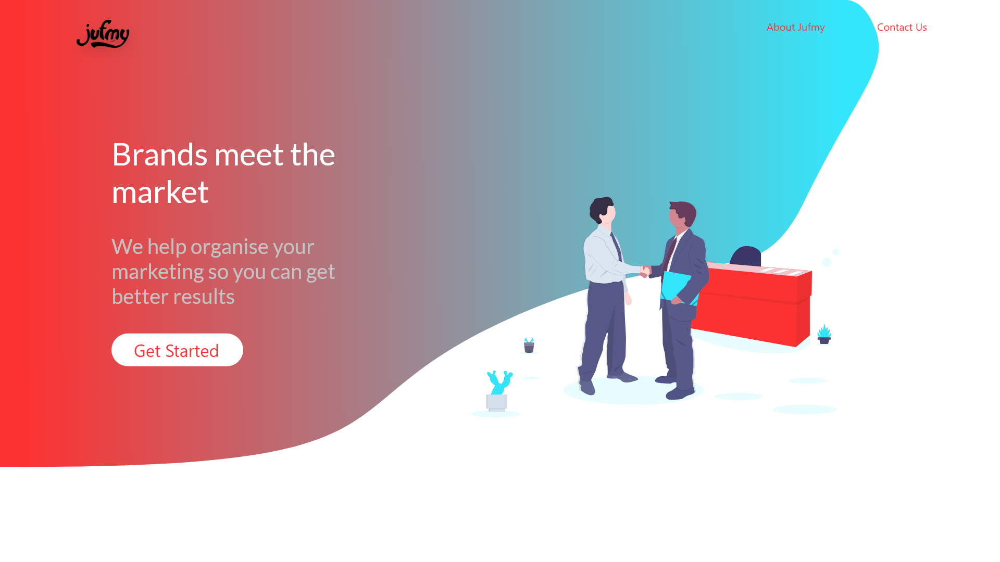
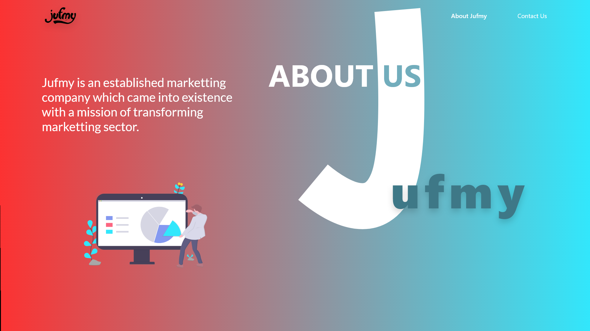

# Jufmy

Use this repo only for Web Development and Designing

## Getting Started

To look into the design, check the design folder. All needed assets have been exported in design/img

### To View Design

If you dont have Adobe XD installed then view the design with the following links.
* **For Prototyping** - [Link](https://xd.adobe.com/view/2d534755-79bd-435f-42d9-399e2449ac8d-5b62/?fullscreen)
* **For Design Specs** - [Link](https://xd.adobe.com/spec/905af483-6569-41d4-6ba1-38a8187bce22-e66b/)

## Design

* **Home Page** 

* **About Us** 

* **Contact** 

## Authors

* **Dhruv Vyas** - *Design* - [DHvyas](https://github.com/DHvyas)
* Add your name here if author

## License

This project is licensed under the MIT License.
